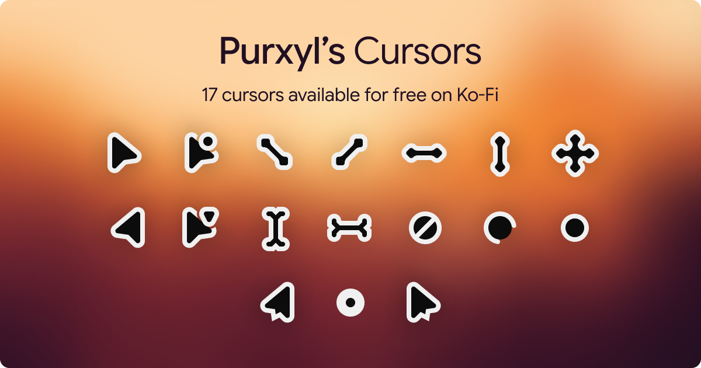

# Purxyl's Cursors

This cursor pack is a collection of dark-themed cursors designed by myself, Purxyl, as a free alternative to default cursors. It comes with 17 different cursors including 2 alternative version of the default cursor, and an alternative version of the inversed cursor.

##  Installation

Grab a [release of Purxyl's Cursors]() via the release page on the Github repository.

Once downloaded, you can install it by right-clicking on the `install.inf` file and selecting "Install". This will add the cursors to your system, and you can then select them from your mouse settings.

<!-- ##  Do you like it?

If you do, consider supporting me on [Ko-Fi](https://ko-fi.com/purxyl) or staring this repository on Github. Your support helps me a lot, Thank you so much for using my cursors!

 -->

##  License

This cursor pack is licensed under the [CC BY-SA 4.0 International License](https://creativecommons.org/licenses/by-sa/4.0/) — [See license file](./LICENSE). 

You are free to use, modify, and distribute the cursors in this pack, as long as you give appropriate credit to the original creator (Purxyl) and share any derivative works under the same license.